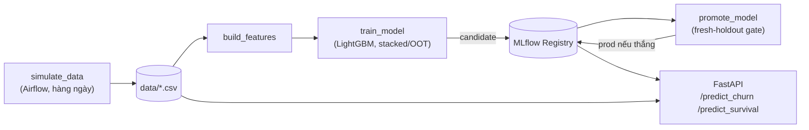

# Customer Analytics Platform

**Hệ thống MLOps end-to-end cho churn, lifetime value và survival modeling của khách hàng** — từ dữ liệu giao dịch thô đến một API dự đoán được triển khai và giám sát.

---

## Bài toán kinh doanh

Vai trò: Data Scientist tại một doanh nghiệp Fintech/E-commerce đang đối mặt ba vấn đề:

1. **CAC tăng.**
2. **Churn cao, tập trung ở nhóm khách hàng giá trị.**
3. **Retention bị mass-marketing** — gửi voucher đại trà, lãng phí ngân sách cho người chắc chắn ở lại/rời đi dù có can thiệp hay không, và gây phiền hà (over-treatment) cho phần còn lại.

**Mục tiêu:** xác định **top 20% khách hàng ưu tiên** để can thiệp, tối đa hoá tỷ lệ giữ chân và ROI ngân sách marketing.

---

## Giải pháp

| Bước | Nội dung |
|---|---|
| **1. EDA định lượng vấn đề** | [`notebooks/01_eda_business_insights.ipynb`](notebooks/01_eda_business_insights.ipynb) — đo mức độ tập trung doanh thu, phân khúc RFM, và định lượng chính xác mức lãng phí của mass-marketing bằng số liệu, không phải phỏng đoán. |
| **2. Propensity model chuẩn chỉnh cho churn** | LightGBM huấn luyện theo **stacked cohorts + out-of-time validation**, đánh giá bằng decile/lift, precision@20%/capture@20%, calibration, SHAP — theo đúng phương pháp luận Propensity Model. Chi tiết: [`docs/model_card_churn.md`](docs/model_card_churn.md). |
| **3. Chấm điểm ưu tiên & mô phỏng chiến dịch** | [`notebooks/02_propensity_targeting_campaign.ipynb`](notebooks/02_propensity_targeting_campaign.ipynb) — kết hợp propensity score với giá trị khách hàng thành **priority score**, cắt top 20%, mô phỏng ROI có holdout/control-group so với mass-marketing và random 20%. |
| **4. Vận hành MLOps** | Toàn bộ pipeline train → evaluate → promote → monitor chạy qua Airflow + MLflow + FastAPI, có cổng promote an toàn (xem [Kết quả](#kết-quả-kinh-doanh) — cổng này vừa cứu dự án khỏi một sự cố thật). |

---

## Kết quả kinh doanh

**Từ EDA** (dữ liệu thật, không mô phỏng):
- **Top 20% khách hàng tạo ra 70% doanh thu** — cơ sở định lượng cho khái niệm "khách hàng giá trị".
- **~60% lượt tiếp cận của một chiến dịch đại trà bị lãng phí** — rơi vào nhóm chắc chắn ở lại hoặc chắc chắn không phản hồi.

**Từ propensity model** (OOT — chưa từng thấy lúc train):
- ROC-AUC = **0.79**, decile-1 lift = **1.65x**, top 20% khách hàng ưu tiên bắt được **32.9%** tổng số khách sẽ churn thật — gấp 1.65 lần ngẫu nhiên.

**Từ mô phỏng chiến dịch** (holdout/control-group, giả định thận trọng):

| Chiến lược | Chi phí | ROI |
|---|---|---|
| Mass marketing (100%) | Cao nhất | ~192% |
| Ngẫu nhiên 20% | 1/5 chi phí mass | ~221% |
| **Propensity-20% (đề xuất)** | 1/5 chi phí mass | **~624%** |

**Một kết quả không nằm trong kế hoạch nhưng quan trọng nhất:** khi áp đúng kỷ luật OOT/business-evaluation của phương pháp luận này vào model đang chạy production, phát hiện model `prod` có **AUC tự báo cáo 0.98 — nhưng khi chấm lại trung thực chỉ đạt 0.74** (bị point-in-time leakage, mắc kẹt hơn một tháng vì cổng promote cũ không thể lật lại một số liệu đã bị thổi phồng). Đã khắc phục: chuyển `prod` sang model trung thực, sửa cổng promote để so sánh apples-to-apples trên cùng một holdout mới. Toàn bộ điều tra và bằng chứng: mục *"Known issue"* trong [`docs/model_card_churn.md`](docs/model_card_churn.md).

---

## Kiến trúc & công nghệ



Python 3.11 · LightGBM, `lifelines`, `lifetimes`, SHAP · FastAPI · MLflow (Postgres + MinIO) · Apache Airflow (CeleryExecutor) · Prometheus/Grafana · Docker Compose (12 container).

**Vài lựa chọn kỹ thuật đáng chú ý:**
- Một module `feature_engineering.py` duy nhất dùng chung cho training lẫn serving — loại bỏ hoàn toàn training-serving skew.
- Model registry theo alias (`candidate`/`prod`), không load file `.pkl` tĩnh — promote là một lệnh, không cần redeploy.
- Mọi feature đều tuân thủ point-in-time (chỉ dùng dữ liệu ≤ snapshot_date) — kỷ luật này chính là thứ đã lộ ra sự cố leakage nói trên.

Chi tiết đầy đủ (lý do thiết kế, xử lý lỗi, khả năng mở rộng...) nằm trong code và docstring của từng file trong `src/` và `scripts/`.

---

## Cấu trúc repository

```
src/            # Feature engineering, schema, inference — nguồn định nghĩa duy nhất
scripts/        # CLI: train (--stacked), evaluate (business metrics), promote (fresh-holdout), monitor drift
notebooks/      # 01_eda_business_insights, 02_propensity_targeting_campaign
docs/           # model_card_churn.md — phương pháp luận + sự cố đã điều tra
airflow/        # 3 DAG: simulate_data → feature_transform → train_and_promote
main.py         # FastAPI serving
docker-compose.yml
```

---

## Bắt đầu nhanh

```bash
docker compose up -d
```

| Service | URL |
|---|---|
| FastAPI docs | http://localhost:8000/docs |
| MLflow UI | http://localhost:5001 |
| Airflow | http://localhost:8080 (`airflow`/`airflow`) |

**Chạy đầy đủ phương pháp luận propensity model:**
```bash
python scripts/train_model.py --stacked data/customers.csv data/transactions.csv
python scripts/evaluate_business_metrics.py data/transactions.csv candidate
python scripts/promote_model.py Churn_model data/transactions.csv   # bắt buộc kèm transactions.csv — xem model card
python scripts/monitor_drift.py data/processed/churn_dataset.csv data/transactions.csv prod
```

---

## Lộ trình phát triển

- [x] Airflow DAGs, mô phỏng dữ liệu liên tục, propensity model chuẩn chỉnh (stacked cohort/OOT/decile-lift/SHAP)
- [x] Giám sát drift cơ bản (PSI), cổng promote apples-to-apples (sau sự cố leakage)
- [ ] CLV endpoint (thay proxy `customer_value` bằng BG/NBD + Gamma-Gamma đã có trong notebook)
- [ ] Uplift model (khi có dữ liệu treated/control thật từ chiến dịch)
- [ ] Drift monitoring lên Grafana/Prometheus; test tự động + CI; API auth

---

## Tác giả

**Thoi Truong** — minh hoạ end-to-end kỹ thuật ML ứng dụng: phân tích → feature dùng chung → thực nghiệm có theo dõi → promote có cổng kiểm soát → serving đóng gói container → giám sát.
